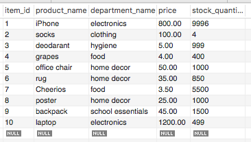
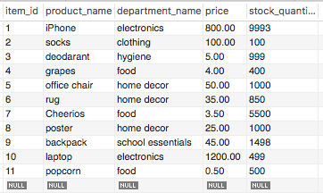

# bamazon

This is a command line app using MySQL and Inquirer.
It's an Amazon-like storefront app that takes in orders from customers and depletes stock from the store's inventory.

Running the customer file will allow users to see every product available.
You can purchase an item, input the quantity you want to buy, and the database will be updated.
If there is not enough of the product in stock, the user will be told and prompted to buy a different product.

Running the manager file allows user to see all the products available, all products with low inventory, and perform different actions on the database, including adding to an inventory, and adding a new product.

Here is the database before the demonstration:

Here's the demonstration:

Here's the database after the demonstration:

